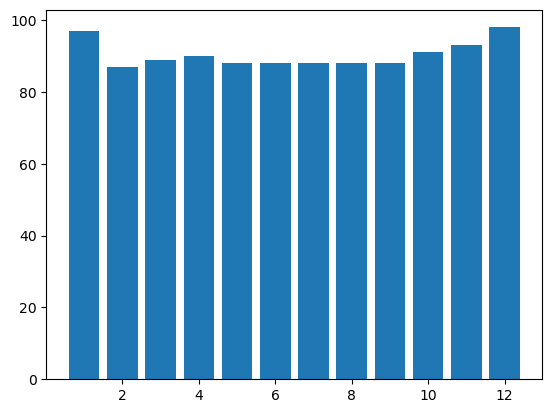

# FetchDataAnalytics
This is an exercise for Fetch Summer Internship
## Prerequisites
- Python 3.8 or above
- sqlite3

I used Jupyter Notebook to record my SQL queries. To install Jupyter Notebook and sql for python, run the following command in your terminal

```bash
pip install --user --upgrade pip
pip install --user --upgrade jupyter
pip install --user --upgrade ipython-sql
```

## How to run the code
Use the run.sh to generate the Database and run the SQL queries with the file test.ipynb
```bash
sh run.sh
```
data.ipynb has all the code for section 3
# Section 1 ER Diagram

Underlined attribute is the key for each table


## Schema
- Brands: ID, BARCODE, BRAND_CODE, CPG_ID,CATEGORY, CATEGORY_CODE, NAME, ROMANCE_TEXT, RELATED_BRAND_IDS
- Items: REWARDS_RECEIPT_ID, ITEM_INDEX, REWARDS_RECEIPT_ITEM_ID , DESCRIPTION , BARCODE, BRAND_CODE, QUANTITY_PURCHASED, TOTAL_FINAL_PRICE, POINTS_EARNED, REWARDS_GROUP, ORIGINAL_RECEIPT_ITEM_TEXT, MODIFY_DATE
- Receipts: ID, STORE_NAME, PURCHASE_DATE, PURCHASE_TIME, TOTAL_SPENT, REWARDS_RECEIPT_STATUS, USER_ID, USER_VIEWED, PURCHASED_ITEM_COUNT, CREATE_DATE, PENDING_DATE, MODIFY_DATE, FLAGGED_DATE, PROCESSED_DATE, FINISHED_DATE, REJECTED_DATE, NEEDS_FETCH_REVIEW, DIGITAL_RECEIPT, DELETED, NON_POINT_EARNING_RECEIPT
- User: CREATED_DATE, BIRTH_DATE, GENDER, LAST_REWARDS_LOGIN, STATE, SIGN_UP_PLATFORM, SIGN_UP_SOURCE, ID

# Section 2 SQL Queries
## Question 1
Which brand saw the most dollars spent in the month of June?


```sql
%%sql
SELECT  b.NAME, ROUND(sum(i.TOTAL_FINAL_PRICE),2) as "Total Sales in June"
FROM Brands b,  Items i
Where i.MODIFY_DATE LIKE '%-06-%'
AND (b.BRAND_CODE = i.BRAND_CODE
OR b.BARCODE = i.BARCODE)
GROUP BY b.NAME
ORDER BY sum(i.TOTAL_FINAL_PRICE) DESC
LIMIT 1;
```


<table>
    <thead>
        <tr>
            <th>NAME</th>
            <th>Total Sales in June</th>
        </tr>
    </thead>
    <tbody>
        <tr>
            <td>Keebler</td>
            <td>179943.7</td>
        </tr>
    </tbody>
</table>


## Question 2
Which user spent the most money in the month of August?


```sql
%%sql
SELECT u.ID as "USER ID", ROUND(sum(i.TOTAL_FINAL_PRICE),2) as "Total Spends in August"
FROM Items i, Receipts r, User u
WHERE i.MODIFY_DATE LIKE '%-08-%'
AND i.REWARDS_RECEIPT_ID = r.ID
AND r.USER_ID = u.ID
GROUP BY u.ID
ORDER BY sum(i.TOTAL_FINAL_PRICE) DESC
LIMIT 1;
```


<table>
    <thead>
        <tr>
            <th>USER ID</th>
            <th>Total Spends in August</th>
        </tr>
    </thead>
    <tbody>
        <tr>
            <td>609ab37f7a2e8f2f95ae968f</td>
            <td>157719.27</td>
        </tr>
    </tbody>
</table>


## Question 3
What user bought the most expensive item?

There my be the case there are two user purchased the same expensive item. The fllowing code output one user


```sql
%%sql
SELECT u.ID as "User that purchased the most expensive item", u.STATE as "State", (e.TOTAL_FINAL_PRICE/e.QUANTITY_PURCHASED) as "Price of the most expensive item"
FROM Receipts r, User u, (SELECT * 
FROM Items
ORDER BY (TOTAL_FINAL_PRICE/QUANTITY_PURCHASED) DESC
LIMIT 1) as e
Where e.REWARDS_RECEIPT_ID = r.ID
AND r.USER_ID = u.ID;

```


<table>
    <thead>
        <tr>
            <th>User that purchased the most expensive item</th>
            <th>State</th>
            <th>Price of the most expensive item</th>
        </tr>
    </thead>
    <tbody>
        <tr>
            <td>617376b8a9619d488190e0b6</td>
            <td>NY</td>
            <td>31005.99</td>
        </tr>
    </tbody>
</table>


To output all the users that purchased the most expensive item


```sql
%%sql
SELECT u.ID as "User that purchased the most expensive item", u.STATE as "State", (e.TOTAL_FINAL_PRICE/e.QUANTITY_PURCHASED)  as "Price of the most expensive item"
FROM Receipts r, User u, (SELECT * 
FROM Items
ORDER BY (TOTAL_FINAL_PRICE/QUANTITY_PURCHASED) DESC
LIMIT 1) as e, Items i
Where (i.TOTAL_FINAL_PRICE/i.QUANTITY_PURCHASED) = (e.TOTAL_FINAL_PRICE/e.QUANTITY_PURCHASED)
AND i.REWARDS_RECEIPT_ID = r.ID
AND r.USER_ID = u.ID;
```


<table>
    <thead>
        <tr>
            <th>User that purchased the most expensive item</th>
            <th>State</th>
            <th>Price of the most expensive item</th>
        </tr>
    </thead>
    <tbody>
        <tr>
            <td>617376b8a9619d488190e0b6</td>
            <td>NY</td>
            <td>31005.99</td>
        </tr>
        <tr>
            <td>617376b8a9619d488190e0b6</td>
            <td>NY</td>
            <td>31005.99</td>
        </tr>
    </tbody>
</table>


## Question 4
What is the name of the most expensive item purchased?


```sql
%%sql
SELECT ORIGINAL_RECEIPT_ITEM_TEXT as "Most expensive item", (TOTAL_FINAL_PRICE/QUANTITY_PURCHASED) as "Price of the most expensive item", DESCRIPTION as "Description"
FROM Items
ORDER BY (TOTAL_FINAL_PRICE/QUANTITY_PURCHASED) DESC
LIMIT 1;
```


<table>
    <thead>
        <tr>
            <th>Most expensive item</th>
            <th>Price of the most expensive item</th>
            <th>Description</th>
        </tr>
    </thead>
    <tbody>
        <tr>
            <td>STRBCKS IC CF BL</td>
            <td>31005.99</td>
            <td>Starbucks Iced Coffee Premium Coffee Beverage Unsweetened Blonde Roast Bottle 48 Oz 1 Ct</td>
        </tr>
    </tbody>
</table>


I used the ORIGINAL_RECEIPT_ITEM_TEXT to find the name of the most expensive item. The following code output all the elements of the most expensive item.


```sql
%%sql
SELECT *
FROM Items
ORDER BY (TOTAL_FINAL_PRICE/QUANTITY_PURCHASED) DESC
LIMIT 1;
```


<table>
    <thead>
        <tr>
            <th>REWARDS_RECEIPT_ID</th>
            <th>ITEM_INDEX</th>
            <th>REWARDS_RECEIPT_ITEM_ID</th>
            <th>DESCRIPTION</th>
            <th>BARCODE</th>
            <th>BRAND_CODE</th>
            <th>QUANTITY_PURCHASED</th>
            <th>TOTAL_FINAL_PRICE</th>
            <th>POINTS_EARNED</th>
            <th>REWARDS_GROUP</th>
            <th>ORIGINAL_RECEIPT_ITEM_TEXT</th>
            <th>MODIFY_DATE</th>
        </tr>
    </thead>
    <tbody>
        <tr>
            <td>62c6300d0a72315a3e1b202e</td>
            <td>0</td>
            <td>deab389b6f6ecfef51d595ab07c40e51</td>
            <td>Starbucks Iced Coffee Premium Coffee Beverage Unsweetened Blonde Roast Bottle 48 Oz 1 Ct</td>
            <td>048500201831</td>
            <td>STARBUCKS</td>
            <td>1.0</td>
            <td>31005.99</td>
            <td>310059.90</td>
            <td>STARBUCKS 21 OZ OR LARGER MULTISERVE</td>
            <td>STRBCKS IC CF BL</td>
            <td>2022-07-07T07:11:50.648Z</td>
        </tr>
    </tbody>
</table>


## Question 5
How many users scanned in each month?

### Scenario 1
We can calculate one user multiple times in one month. 
For example, a single user scanned 3 times in June, then the number of users scanned in June is 3.


```sql
%%sql
SELECT m1."Jan", m2."Feb", m3."Mar", m4."Apr", m5."May", m6."Jun", m7."Jul", m8."Aug", m9."Sep", m10."Oct", m11."Nov", m12."Dec"
FROM(SELECT COUNT(USER_ID) as "Jan"
     FROM Receipts
     WHERE DATE_SCANNED LIKE '%-01-%') as m1, (SELECT COUNT(USER_ID) as "Feb" FROM Receipts WHERE DATE_SCANNED LIKE '%-02-%') as m2, (SELECT COUNT(USER_ID) as "Mar" FROM Receipts WHERE DATE_SCANNED LIKE '%-03-%') as m3, (SELECT COUNT(USER_ID) as "Apr" FROM Receipts WHERE DATE_SCANNED LIKE '%-04-%') as m4, (SELECT COUNT(USER_ID) as "May" FROM Receipts WHERE DATE_SCANNED LIKE '%-05-%') as m5, (SELECT COUNT(USER_ID) as "Jun" FROM Receipts WHERE DATE_SCANNED LIKE '%-06-%') as m6, (SELECT COUNT(USER_ID) as "Jul" FROM Receipts WHERE DATE_SCANNED LIKE '%-07-%') as m7, (SELECT COUNT(USER_ID) as "Aug" FROM Receipts WHERE DATE_SCANNED LIKE '%-08-%') as m8, (SELECT COUNT(USER_ID) as "Sep" FROM Receipts WHERE DATE_SCANNED LIKE '%-09-%') as m9, (SELECT COUNT(USER_ID) as "Oct" FROM Receipts WHERE DATE_SCANNED LIKE '%-10-%') as m10, (SELECT COUNT(USER_ID) as "Nov" FROM Receipts WHERE DATE_SCANNED LIKE '%-11-%') as m11, (SELECT COUNT(USER_ID) as "Dec" FROM Receipts WHERE DATE_SCANNED LIKE '%-12-%') as m12

```


<table>
    <thead>
        <tr>
            <th>Jan</th>
            <th>Feb</th>
            <th>Mar</th>
            <th>Apr</th>
            <th>May</th>
            <th>Jun</th>
            <th>Jul</th>
            <th>Aug</th>
            <th>Sep</th>
            <th>Oct</th>
            <th>Nov</th>
            <th>Dec</th>
        </tr>
    </thead>
    <tbody>
        <tr>
            <td>4222</td>
            <td>3830</td>
            <td>4767</td>
            <td>4882</td>
            <td>5627</td>
            <td>5405</td>
            <td>6058</td>
            <td>6191</td>
            <td>6355</td>
            <td>7305</td>
            <td>7512</td>
            <td>8447</td>
        </tr>
    </tbody>
</table>


### Scenario 2
We need to calculate the number of users in each month by using the unique values of the USER_ID.
For example, a user scanned 3 times in June, then the number of users in June is 1.


```sql
%%sql
SELECT m1."Jan", m2."Feb", m3."Mar", m4."Apr", m5."May", m6."Jun", m7."Jul", m8."Aug", m9."Sep", m10."Oct", m11."Nov", m12."Dec"
FROM(SELECT COUNT(DISTINCT USER_ID) as "Jan"
     FROM Receipts
     WHERE DATE_SCANNED LIKE '%-01-%') as m1, (SELECT COUNT(DISTINCT USER_ID) as "Feb" FROM Receipts WHERE DATE_SCANNED LIKE '%-02-%') as m2, (SELECT COUNT(DISTINCT USER_ID) as "Mar" FROM Receipts WHERE DATE_SCANNED LIKE '%-03-%') as m3, (SELECT COUNT(DISTINCT USER_ID) as "Apr" FROM Receipts WHERE DATE_SCANNED LIKE '%-04-%') as m4, (SELECT COUNT(DISTINCT USER_ID) as "May" FROM Receipts WHERE DATE_SCANNED LIKE '%-05-%') as m5, (SELECT COUNT(DISTINCT USER_ID) as "Jun" FROM Receipts WHERE DATE_SCANNED LIKE '%-06-%') as m6, (SELECT COUNT(DISTINCT USER_ID) as "Jul" FROM Receipts WHERE DATE_SCANNED LIKE '%-07-%') as m7, (SELECT COUNT(DISTINCT USER_ID) as "Aug" FROM Receipts WHERE DATE_SCANNED LIKE '%-08-%') as m8, (SELECT COUNT(DISTINCT USER_ID) as "Sep" FROM Receipts WHERE DATE_SCANNED LIKE '%-09-%') as m9, (SELECT COUNT(DISTINCT USER_ID) as "Oct" FROM Receipts WHERE DATE_SCANNED LIKE '%-10-%') as m10, (SELECT COUNT(DISTINCT USER_ID) as "Nov" FROM Receipts WHERE DATE_SCANNED LIKE '%-11-%') as m11, (SELECT COUNT(DISTINCT USER_ID) as "Dec" FROM Receipts WHERE DATE_SCANNED LIKE '%-12-%') as m12

```


<table>
    <thead>
        <tr>
            <th>Jan</th>
            <th>Feb</th>
            <th>Mar</th>
            <th>Apr</th>
            <th>May</th>
            <th>Jun</th>
            <th>Jul</th>
            <th>Aug</th>
            <th>Sep</th>
            <th>Oct</th>
            <th>Nov</th>
            <th>Dec</th>
        </tr>
    </thead>
    <tbody>
        <tr>
            <td>97</td>
            <td>87</td>
            <td>89</td>
            <td>90</td>
            <td>88</td>
            <td>88</td>
            <td>88</td>
            <td>88</td>
            <td>88</td>
            <td>91</td>
            <td>93</td>
            <td>98</td>
        </tr>
    </tbody>
</table>

# Section 3 Noteworthy Findings

## Sales per Month

After finish question 5, I immediately noticed that the number of sales per month is increasing, while the number of unique users scanned in each month is 
steady. This suggests that the average number of items purchased per user is increasing by month, and the spending is also likely to increase. 

## Disttribution:

The Distribution of number of users scanned has mean 5883.42 and standard deviation  1235.77


The Distribution of number of unique users scanned has mean 90.42 and standard deviation  3.55



Use dividsion with the above two, and get the Distribution of average scanned per person in each month has mean 64.95 and standard deviation  13.50


## Conclusion

These distribution suggests for each individual user, they are likely to make more purchase as the month goes by. This is likely due to the fact that some major holidays are in the later months, and people are more likely to purchase gifts for their family and friends.

## Suggestions

I would suggest that the company should focus on the later months, and try to increase the number of unique users scanned in each month. This will likely increase the total sales for the company.

## SQL Query to total spending per month

```sql
%%sql
SELECT m1."Jan", m2."Feb", m3."Mar", m4."Apr", m5."May", m6."Jun", m7."Jul", m8."Aug", m9."Sep", m10."Oct", m11."Nov", m12."Dec"
FROM(SELECT ROUND(SUM(TOTAL_FINAL_PRICE),2) as "Jan"
     FROM Items
     WHERE MODIFY_DATE LIKE '%-01-%') as m1, (SELECT ROUND(SUM(TOTAL_FINAL_PRICE),2) as "Feb" FROM Items WHERE MODIFY_DATE LIKE '%-02-%') as m2, (SELECT ROUND(SUM(TOTAL_FINAL_PRICE),2) as "Mar" FROM Items WHERE MODIFY_DATE LIKE '%-03-%') as m3, (SELECT ROUND(SUM(TOTAL_FINAL_PRICE),2) as "Apr" FROM Items WHERE MODIFY_DATE LIKE '%-04-%') as m4, (SELECT ROUND(SUM(TOTAL_FINAL_PRICE),2) as "May" FROM Items WHERE MODIFY_DATE LIKE '%-05-%') as m5, (SELECT ROUND(SUM(TOTAL_FINAL_PRICE),2) as "Jun" FROM Items WHERE MODIFY_DATE LIKE '%-06-%') as m6, (SELECT ROUND(SUM(TOTAL_FINAL_PRICE),2) as "Jul" FROM Items WHERE MODIFY_DATE LIKE '%-07-%') as m7, (SELECT ROUND(SUM(TOTAL_FINAL_PRICE),2) as "Aug" FROM Items WHERE MODIFY_DATE LIKE '%-08-%') as m8, (SELECT ROUND(SUM(TOTAL_FINAL_PRICE),2) as "Sep" FROM Items WHERE MODIFY_DATE LIKE '%-09-%') as m9, (SELECT ROUND(SUM(TOTAL_FINAL_PRICE),2) as "Oct" FROM Items WHERE MODIFY_DATE LIKE '%-10-%') as m10, (SELECT ROUND(SUM(TOTAL_FINAL_PRICE),2) as "Nov" FROM Items WHERE MODIFY_DATE LIKE '%-11-%') as m11, (SELECT ROUND(SUM(TOTAL_FINAL_PRICE),2) as "Dec" FROM Items WHERE MODIFY_DATE LIKE '%-12-%') as m12
```


<table>
    <thead>
        <tr>
            <th>Jan</th>
            <th>Feb</th>
            <th>Mar</th>
            <th>Apr</th>
            <th>May</th>
            <th>Jun</th>
            <th>Jul</th>
            <th>Aug</th>
            <th>Sep</th>
            <th>Oct</th>
            <th>Nov</th>
            <th>Dec</th>
        </tr>
    </thead>
    <tbody>
        <tr>
            <td>207651.49</td>
            <td>156318.83</td>
            <td>182730.82</td>
            <td>197508.83</td>
            <td>230472.18</td>
            <td>257568.37</td>
            <td>384211.49</td>
            <td>406143.41</td>
            <td>246454.94</td>
            <td>282674.03</td>
            <td>345410.1</td>
            <td>422540.41</td>
        </tr>
    </tbody>
</table>

## Distribution of total spending per month with mean 276640.41 and standard deviation 87616.13


Divide the total spending per month by the number of user scanned in each month and get the distribution of average spending per user scanned per month

## Distribution of average spending per user scanned per month with mean 46.66 and standard deviation 8.94


## Conclusion
From the above distribution, we learn that the average spending per user scanned per month is highest during July and August. This is likely due to the fact that these two months are summer months, and people are more likely to go out and spend money on food and entertainment. In addition, schools are out during these two months, and people are more likely to spend money on their children. Peoplare are likely to spend money on expensive items during these two months. Even though the total spending is not the highest.
## Suggestions
I would suggest that the company that sales expensive items should focus on July and August, because people are likely to spend more money per purchase. For this reason, products like laptops and phones are likely to sell more during these two months. Companies that sells sepnsive items are likely to earn more profits by advertising their products more during these two months, and also by offering discounts during these two months.